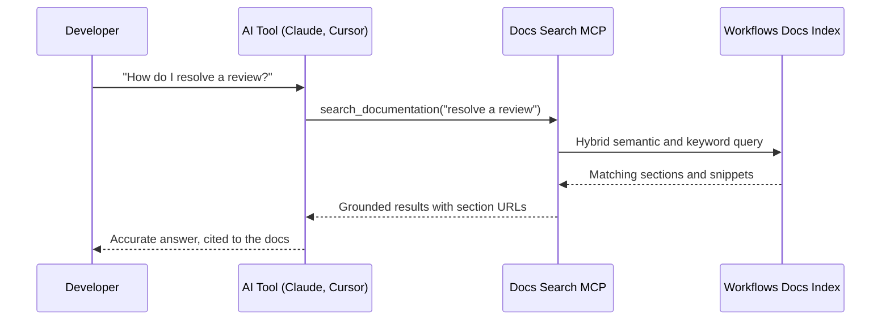

## Overview

These docs ship an MCP (Model Context Protocol) server, so external AI tools can search and retrieve this documentation directly.
The server exposes a single read-only tool, `search_documentation`, which runs a hybrid search over the same indexed content this site renders.

That means Claude, Cursor, and any other MCP-compatible client can answer questions about the Workflows API with grounded, current documentation rather than from memory.

<Callout kind="info">
  This is the read-only documentation search server.
  It is separate from the Deepvue MCP that runs live verifications, and it needs no credentials.
</Callout>

## Endpoint

```
https://docs.deepvue.link/_mcp
```

The platform also serves the same server at its default hostname, `https://decisioning.documentationai.com/_mcp`.
Prefer the custom domain above: it is the canonical one and it stays stable if the platform hostname changes.

## Capabilities

| Feature | Details |
|---------|---------|
| **Server name** | `Deepvue Workflows` |
| **Tool** | `search_documentation` |
| **Search** | Hybrid, blending semantic and keyword matching |
| **Search scope** | Every page, heading, API reference section, and code snippet on this site |
| **Access** | Read-only. No content modification |
| **Auth** | None required |

## Connect to the MCP server

<Tabs>
  <Tab title="Claude Code" icon="terminal">
    Add the server to your project's `.mcp.json`:

    ```json
    {
      "mcpServers": {
        "deepvue-workflows-docs": {
          "type": "http",
          "url": "https://docs.deepvue.link/_mcp"
        }
      }
    }
    ```

    Or add it from the command line:

    ```bash
    claude mcp add --transport http deepvue-workflows-docs https://docs.deepvue.link/_mcp
    ```
  </Tab>

  <Tab title="Claude Desktop" icon="bot">
    Add the following to `claude_desktop_config.json`:

    ```json
    {
      "mcpServers": {
        "deepvue-workflows-docs": {
          "type": "http",
          "url": "https://docs.deepvue.link/_mcp"
        }
      }
    }
    ```

    Restart Claude Desktop, and it will search these docs when you ask about the Workflows API.
  </Tab>

  <Tab title="Cursor" icon="code">
    In Cursor, go to **Settings, then MCP**, and add a new server:

    - **Name**: `deepvue-workflows-docs`
    - **Type**: `http`
    - **URL**: `https://docs.deepvue.link/_mcp`

    Cursor invokes `search_documentation` automatically when it needs context about the Workflows API.
  </Tab>
</Tabs>

## Tool reference

### `search_documentation`

| Parameter | Type | Required | Default | Notes |
|-----------|------|:--------:|---------|-------|
| `query` | string | Yes | | What to search for |
| `limit` | number | No | `10` | Maximum results to return |
| `semanticRatio` | number | No | `0.75` | Blend of semantic against keyword matching, from `0` to `1`. Higher favours meaning, lower favours exact matches |

Each result is a matched **section**, not a whole page.

| Field | Notes |
|-------|-------|
| `url` | Direct link to the matched section |
| `parent_url` | The page containing it. Fetch this when you need the full page |
| `page_title` | Title of the parent page |
| `section_title` | Title of the matched section |
| `breadcrumb` | Navigation path to the section |
| `content` | Section content as plain text |
| `llm_markdown` | The same content as markdown, shaped for model consumption |

The response also carries a `count` of results returned.

<Callout kind="info">
  Because results are sections rather than pages, a broad question can match several sections of one page.
  Follow `parent_url` when you need surrounding context.
</Callout>

## Example usage

Once connected, ask your AI tool questions like:

- "How do I resolve a review on a Deepvue Workflows run?"
- "What are the six run statuses, and which are terminal?"
- "What is the difference between an abandoned run and an expired one?"
- "Which run error codes are worth retrying?"
- "What does the report content model return for a flagged step?"
- "How do I configure a lifecycle webhook for a workflow?"

## How it works



<Callout kind="info">
  The server indexes public documentation only.
  Everything searchable through MCP is content already published on this site.
</Callout>

## Next steps

<Columns cols="3">
  <Card title="Quickstart" icon="zap" href="/quickstart">
    Start your first run and read its result.
  </Card>

  <Card title="Authentication" icon="lock" href="/authentication">
    The credentials the API itself needs, which MCP does not.
  </Card>

  <Card title="Conventions and objects" icon="layers" href="/concepts">
    The object model your AI tool will be reading about.
  </Card>
</Columns>
